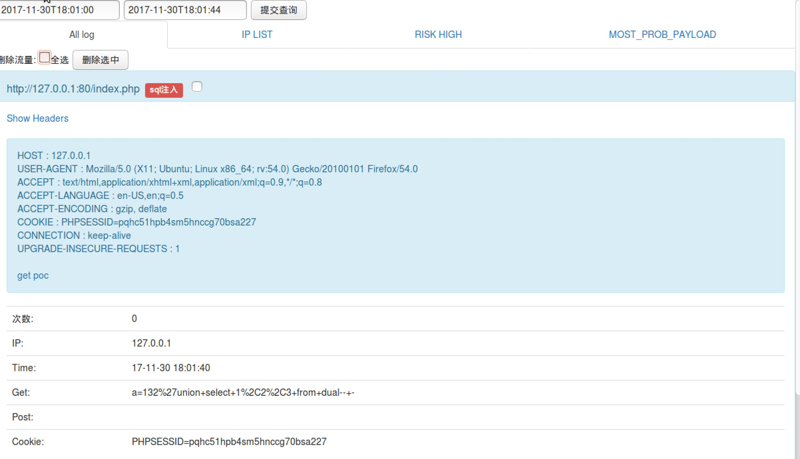

## 一个针对php的web流量抓取、分析的应用。

可供ctf线下赛使用，也可用于实际场景来抓web流量、分析攻击手段。




目前主要功能如下：

1. 完整http报文请求抓取，同时进行对可能存在的攻击进行分类，通过文件存储模拟出数据库，适应各种场合。

2. 根据hash判断流量是否重复，只记录次数和最新一次的请求包，减少存储空间的占用以及流量分析的成本。

3. 4个waf等级，推荐使用1等级，不会影响应用的正常运行，还可以抵御绝大多数的常见攻击。

4. 设置flag获取命令，通过分析页面返回判断是否被读取了flag，从而替换掉flag（有些场合可能无法使用），将此流量标记为危险流量，同时攻击者ip加入黑名单，永
久ban掉（可从黑名单去除）。

5. 黑白名单模式，可以手动添加，选择白名单模式，则服务正常通过给白名单机器，其他机器全部拦截。

6. 可根据ip、时间筛选出想要查看的对应日志。

7. 通过分析是否为危险流量，统计相同流量出现次数，显示出最可能是最终payload的流量排行。

8. 一键生成ctf线下赛exp（获取flag+自动提交flag），快人一步进行攻击（除了正常攻击流量外，exp中还包含大量垃圾混淆流量）

9. 删除并压缩备份选中的流量。

9. 因流量转发太过不公平，不考虑添加。

## 使用方法：

weglogger部署

1. 将weblogger文件夹放至web目录下，并chmod -R 777 weblogger/。

2. 浏览器访问http://ip/weblogger/install.php

3. 数据存储目录：/tmp   

   Web根目录：/var/www/html/ （根据实际情况填写，最后必须要加 / ）

4. 输入flag获取命令：cat flag文件路径（为了获取flag中的内容进行替换）

   ​    管理员账号密码（必须要输入）：用于认证使用weblogger者的身份，防止别人访问。

5. 将返回的weblogpro.php的路径包含在所有php文件中，在php文件开头添加：

```
require_once('weblogpro.php路径');
下面的命令可以批量包含 
find /var/www/html/ -path /var/www/html/124687a7bc37d57cc9ecd1cbd9d676f7 -prune -o  -type f -name '*.php'|xargs  sed -i '1i<?php require_once("/tmp/33253f64133730fabaa52a487ff98740/weblogpro.php");?>'
```

6. 访问4返回的后台路径，输入4中的管理员账号密码登录。

注意事项：

1. 第二步Web根目录最后必须要加`/`

2. 第四部必须要输入管理员账号密码

3. web目录需要有写入权限

4. 第六步登录后页面显示有问题的话，将静态文件放入管理后台所在的php目录即可。

更详细说明和帮助：
https://gist.github.com/wupco/ee26f88656fbf36d014f49b4ac47ddc8


## 说明:

 weblogger 分为静态文件群和动态文件群：

动态文件群：
- 所有流量数据与脚本模板均存储在tmp目录下，所以要保证tmp目录的持续可写。 

静态文件群：
- web管理页面存在web目录下的一个新建文件中，所以要保证web目录的可写(待install.php生成管理文件结束后可设置目录不可写)
